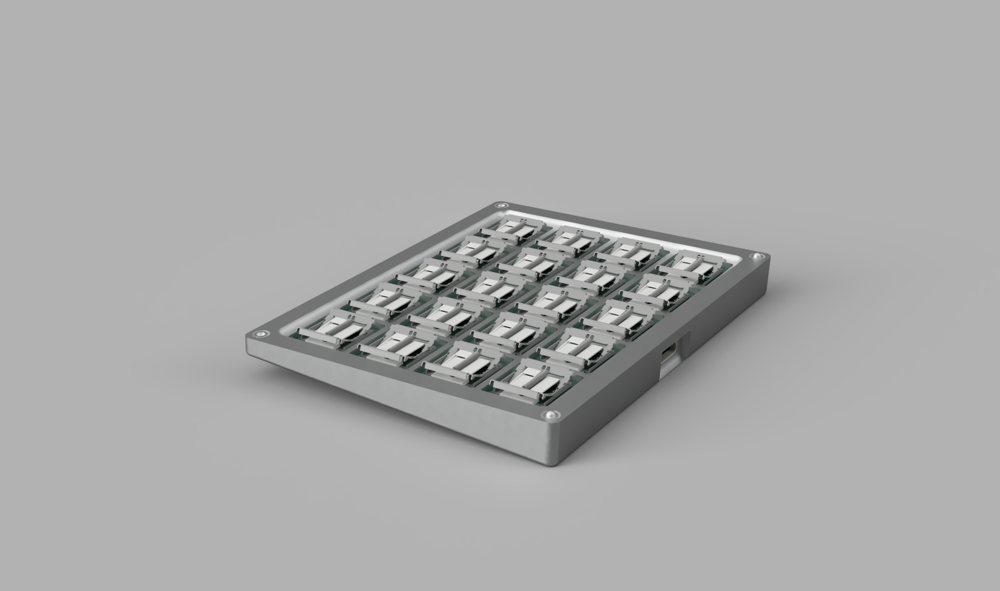

# Pockey

An ultra-low-profile wireless split keyboard built around ultra-thin Cherry MX switches. Pockey follows the Apple Magic Keyboard design philosophy — including the gentle 4° typing tilt — for a slim, unobtrusive desk presence. Each half packs into a closed sandwich: the two halves are magnetically collapsible and snap together when stacked on top of one another, making the whole keyboard pocketable and travel-ready.



## Features

- **Ultra-low-profile** chassis — millimeters thick on the desk
- **Ultra-thin Cherry MX switches** for proper tactile/clicky feel without the height
- **Apple Magic Keyboard-inspired** industrial design — including a 4° typing tilt
- **30-key** layout
- **Wireless** — months of battery life on a single charge thanks to a low-power MCU and aggressive sleep
- **Magnetically collapsible halves** — stack one on top of the other and the magnets pull them flush together for transport

## Status

**Functionally complete** — finishing touches remain before fabrication (see "Known gaps" below).

## Schematic recovery note

`Pockey.kicad_sch` and `LeftMatrix.kicad_sch` were **missing** from the working directory at the time this repo was created — they were lost sometime after January 2025, and the three most recent backups (dated 2026-04-16) no longer contained them either.

They were **restored from** `KiCad/backups/Pockey-2025-01-22_173850.zip` — the last backup that still contained the real schematic files. The restored schematic is dated **2025-01-20 14:26** internally. Any schematic edits between that date and when the file went missing are not recoverable.

## Folder layout

```
Pockey/
├── KiCad/              KiCad 7+ project — open Pockey.kicad_pro
│   ├── Pockey.kicad_pcb         Main board layout
│   ├── Pockey.kicad_sch         Top-level schematic (restored from backup)
│   ├── LeftMatrix.kicad_sch     Switch matrix sub-sheet (restored from backup)
│   ├── Pockey.kicad_pro         KiCad project file
│   ├── Pockey.kicad_prl         Local KiCad state
│   ├── fp-info-cache            KiCad footprint cache
│   ├── backups/                 Dated snapshots — incl. the one the schematic was recovered from
│   └── Pockey-backups/          KiCad auto-backup folder (created on project reopen)
├── Renders/            Pockey_2025-Jan-21 CAD render of populated PCB
├── 3D/                 Pockey.step — mechanical model of the board + case
├── Fabrication/        PCB outline DXFs (V2 = previous, V3 = current)
└── JLCPCB/             Empty — gerbers not yet generated
```

## Known gaps

- **No gerbers / JLCPCB order files.** `JLCPCB/` is an empty placeholder.
- **No BOM / pick-and-place files.**
- **Only one render** — the Jan 2025 CAD export above. No WIP photos, no rendered keycap variants.
- **No printable case STLs** — only the `.step` source is included.
- **No sub-schematic kicad_pro for `LeftMatrix`** — only the `.sch` file was recovered.
- **Excluded from the copy:** macOS `._*` AppleDouble metadata files and the three "bad" 2026-04-16 backup zips that did not contain the real schematic.
